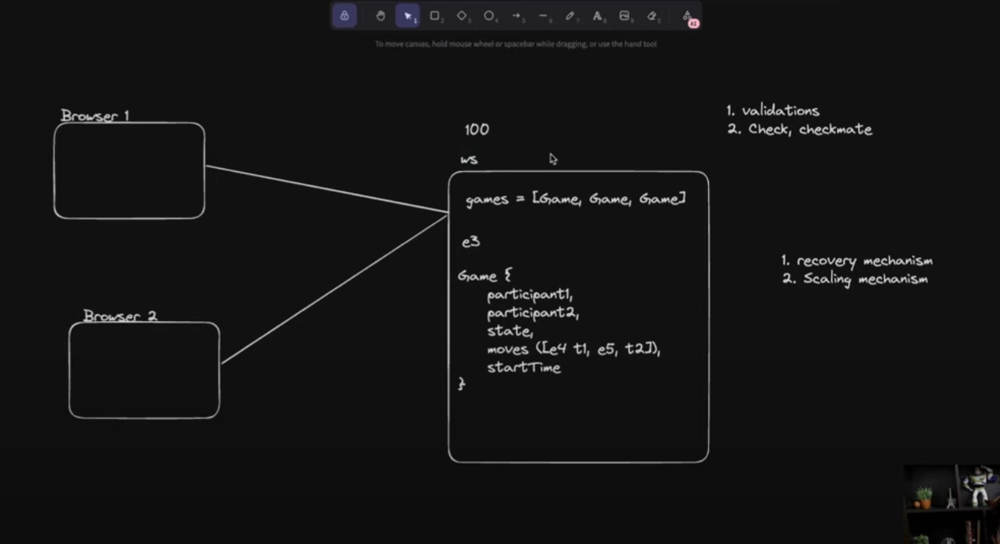

  -> System-Architecture.

1. npx tsc --init -> initilize backend in Typescript.
2. Now need websocket in node.js -> ws-library -> npm i @types/ws
copy "Simple server" code ws library page.
3. tsc -b -> take our TypeScript code and compile it to JavaScript.
node dist/index.js -> to start
4. node dist/index.js 
5. visit hoppscotch.io to check ur server is working or not -> realtime Tab -> webSoclet -> ws://localhost:8080 -> Connect.
6. Now ew check we are getting response msg from font end now we need to save those so we can use it share it to another browser.
7.
8.use this libary to get chess validations -> chess.js';
9. Backend is ready

## FrontEnd

1. npm create vite@latest
2. dependancies 
- tailwind css
        - npm install -D tailwindcss postcss autoprefixer
        - npm tailwindcss init -p
        - update tailwind.config.js
- react Rounter DOM

- npm run dev