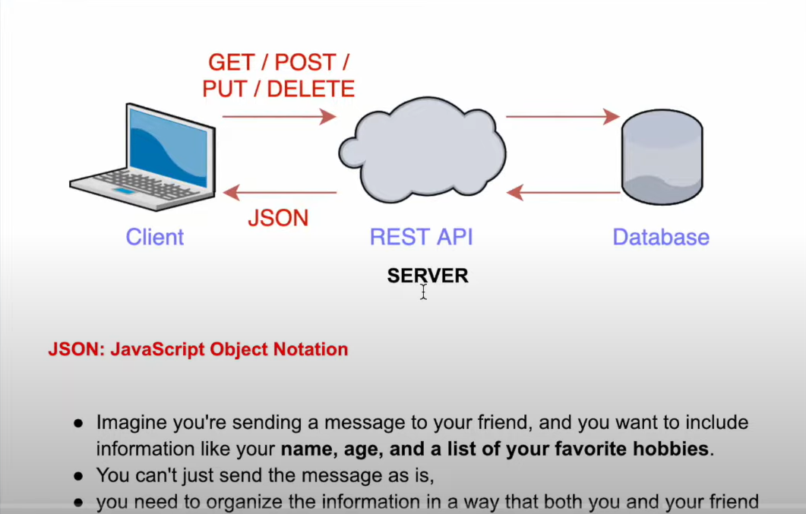

# What are API and Endpoints?
• Imagine a menu card in a restaurant
• Lots of options are there, each option will give you a different order
• Now, collection of that list = Menu card = API's
And an option in that list = Endpoint
• And the waiter only understood whatever things are written on the menu
card

# Create a server
Creating a server in NodeJs via express package
• Express.js is a popular framework for building web applications and APIs
using Node.js.
• When you create an Express.js application, you're setting up the
foundation for handling incoming requests and defining how your
application responds to them.
• Now we are going to create a server == waiter
• Now the waiter has his own home?
In simple terms, "localhost" refers to your "own computer". After creating a
server in NodeJS, you can access your environment in 'localhost'
# Port Number?
• Let's suppose in a building - 100 rooms are there, for someone to reach he
must know the room number right?

# Methods to share data
• Now, in the world of web development, we need to deal with data
• How data is sent and received between a client (like a web browser) and a
server (built with Node.js)
• So there are lots of methods out there to send or receive data according to
their needs.
GET
• POST
• PATCH
- DELETE

# Get
- imagine you want to read book in library shelf you can only read, cant over right cant tire book
- you couldnt change anything
- you just want to get the information

Similar, Get method is  used to request data from the server
e.g. as you enter website URL, your browser sends GET request to server to fetch the web page.