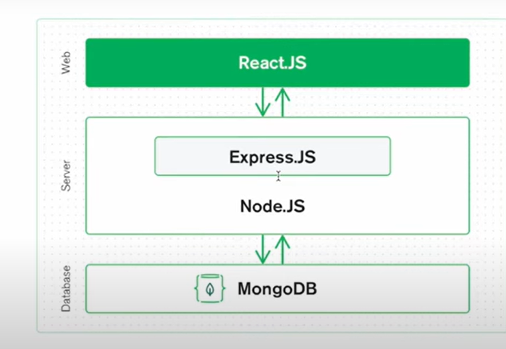

# DAY 4
# Database
Web development = client + server + database
• Ultimately, Let's suppose we are going to open Restuarant and there is lots
of data around it,
Number of chefs
Each Person's Detail (like chef, owner, manager, waiter)
• Name
• Age
• Work
I
• Mobile number
• Email
• Address
• salary
Menu Details (like, drinks, Snacks, main course)
• Name of dish
• Price
• Taste (like, sweet, sour, spicy)
• Is_drink (boolean true, false)
• Ingredients ( array of data - [ "wheat", "rice", "sugar"]
Number of sales / liko 76 )

• This is all Data we must have to store to run a fully functional restaurant
• So we have to deal with data
• Now There are lots of Database out there in the market, we can use
according to our need
。 SQL
• PostgreSQL
• MongoDB
• MariaDB
• Oracle

